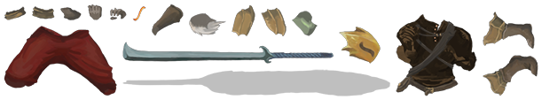
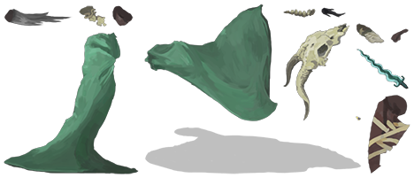
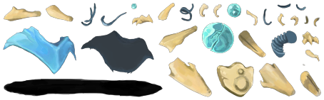

# STS Companion - Slay the Spire Desktop Pet

<p align="center">
  
  
  
  
</p>

<p align="center">
  <b>EN</b> | <a href="#中文说明">中文</a>
</p>

A desktop pet companion for **Slay the Spire** that watches your game in real time — analyzing your deck, suggesting card picks, and warning you before dangerous fights. Like having a coach sitting next to you while you climb the Spire.

## Features

- **Desktop Pet** — A draggable character sprite that lives on your desktop, with breathing animation and mood glow
- **Real-time Deck Analysis** — Automatically detects your character, deck, relics, and floor whenever the save file updates
- **Deck Scoring** — Rates your deck from S to D (0–100) based on archetype completeness, relic synergy, and curse penalty
- **Archetype Detection** — Identifies 14+ build archetypes across all 4 characters (Strength, Block, Exhaust, Poison, Shiv, Frost, Stance Dance, etc.)
- **Card Advice** — Recommends which cards to pick, remove, and upgrade based on your current deck and relics
- **Combat Tips** — Proactive bubble warnings when entering monster/elite/boss rooms with strategy advice
- **Relic Synergy** — Notifies you when you pick up a relic that combos with cards in your deck
- **Event & Shop Advice** — Contextual tips for event choices, shop purchases, and rest site decisions
- **Neow Blessing Guide** — Scores each Neow option and recommends the best pick
- **Act Transitions** — Motivational messages when entering a new act

## Requirements

- **Slay the Spire** (Steam version, Windows)
- **Python 3.10+**
- **ModTheSpire** + **BaseMod** (for real-time combat data)

## Installation

### 1. Python Companion (Required)

```bash
git clone https://github.com/vila-c/slay-the-spire-mod.git
cd slay-the-spire-mod
pip install -r requirements.txt
```

### 2. Java Mod (Optional, for combat data)

The Java mod exports real-time game state (enemy intents, event options, etc.) that the companion uses for combat tips.

Pre-built JAR is included at `sts-mod/companion-agent.jar`. Copy it to your game's `mods/` folder:

```bash
copy sts-mod\companion-agent.jar "C:\Program Files (x86)\Steam\steamapps\common\SlayTheSpire\mods\"
```

Or build from source:

```bash
cd sts-mod
python build_mod.py
```

> Requires `tools/ecj.jar` (Eclipse Compiler) and game JARs on classpath.

### 3. Run

```bash
python main.py
```

Or double-click `start.bat` / `start.pyw`.

## Usage

| Action | Effect |
|--------|--------|
| Left-click pet | Toggle deck analysis panel |
| Right-click pet | Menu (details / settings / quit) |
| Drag pet | Move to any position |
| Pet glows red & bounces | Important warning — check the bubble! |

## Scoring System

| Grade | Score | Meaning |
|-------|-------|---------|
| S | 85+ | Strong deck, aim for the Heart |
| A | 70–84 | Good, push forward |
| B | 50–69 | Average, reinforce your build |
| C | 30–49 | Weak, pick carefully |
| D | <30 | Danger zone |

## Supported Archetypes

| Character | Archetypes |
|-----------|-----------|
| Ironclad | Strength, Block, Exhaust, Bleed/Rage |
| Silent | Shiv, Poison, Discard, Infinite Loop |
| Defect | Lightning, Frost, Claw, Dark/Creative |
| Watcher | Stance Dance, Scry/Divination, Retain Divinity |

## Project Structure

```
main.py                  # Entry point & main loop
core/
  archetypes.py          # Build archetype detection
  card_advisor.py        # Card pick/remove/upgrade advice
  combat_advisor.py      # Monster strategy database
  config.py              # User settings persistence
  decoder.py             # Save file decryption (base64 + XOR)
  event_advisor.py       # Event choice recommendations
  mem_probe.py           # Memory reading utilities
  scorer.py              # Deck scoring engine (0-100)
  shop_advisor.py        # Shop purchase advice
  upgrade_advisor.py     # Campfire upgrade priority
  watcher.py             # Save file change monitor
ui/
  pet_widget.py          # Desktop pet (frameless, draggable, animated)
  bubble.py              # Detail analysis panel
  chat_bubble.py         # Proactive chat bubbles & tips
  toggle_button.py       # Show/hide toggle button
sts-mod/
  src/stscompanion/      # Java mod source (ModTheSpire)
  companion-agent.jar    # Pre-built mod JAR
assets/sprites/          # Character sprites & icons
```

## License

This project is for personal and educational use. Slay the Spire is developed by [MegaCrit](https://www.megacrit.com/).

---

<a name="中文说明"></a>

# STS Companion - 杀戮尖塔桌面宠物伴侣

<p align="center">
  <a href="#sts-companion---slay-the-spire-desktop-pet">EN</a> | <b>中文</b>
</p>

一个杀戮尖塔的桌面宠物伴侣 —— 实时分析你的牌组，给出选牌/升级/移除建议，在危险战斗前主动提醒。就像一个坐在你旁边看你打牌的教练。

## 功能

- **桌面宠物** — 可拖拽的角色立绘，常驻桌面，有呼吸动画和情绪光晕
- **实时牌组分析** — 每次进入新楼层或拿牌后自动更新
- **牌组评分** — S/A/B/C/D 五档评分（0-100），基于流派完整度、遗物配合、诅咒惩罚
- **流派识别** — 自动识别 14+ 种流派（力量、格挡、消耗、毒、飞刀、冰霜、姿态循环等）
- **选牌建议** — 根据当前牌组和遗物推荐拿牌、移除、升级
- **战斗提醒** — 进入怪物/精英/Boss 房间时主动弹出策略建议
- **遗物联动** — 拿到遗物时提示与牌组中卡牌的配合
- **事件/商店建议** — 事件选项建议、商店购买建议、营地决策建议
- **Neow 祝福指南** — 对每个 Neow 选项评分，推荐最优选择
- **幕间台词** — 进入新幕时的鼓励台词

## 环境要求

- **杀戮尖塔**（Steam 版，Windows）
- **Python 3.10+**
- **ModTheSpire** + **BaseMod**（用于实时战斗数据）

## 安装

### 1. Python 伴侣（必需）

```bash
git clone https://github.com/vila-c/slay-the-spire-mod.git
cd slay-the-spire-mod
pip install -r requirements.txt
```

### 2. Java Mod（可选，获取战斗数据）

Java Mod 用于导出实时游戏状态（敌方意图、事件选项等），让伴侣能给出更精准的战斗建议。

预编译 JAR 已包含在 `sts-mod/companion-agent.jar`，复制到游戏 `mods/` 目录即可：

```bash
copy sts-mod\companion-agent.jar "C:\Program Files (x86)\Steam\steamapps\common\SlayTheSpire\mods\"
```

或从源码编译：

```bash
cd sts-mod
python build_mod.py
```

> 需要 `tools/ecj.jar`（Eclipse 编译器）和游戏 JAR 文件。

### 3. 运行

```bash
python main.py
```

或双击 `start.bat` / `start.pyw`。

## 使用方法

| 操作 | 效果 |
|------|------|
| 左键单击宠物 | 弹出/关闭牌组详情面板 |
| 右键单击宠物 | 菜单（查看详情 / 设置 / 退出） |
| 拖拽宠物 | 移动到任意位置 |
| 宠物跳动发红光 | 有重要警告，请查看气泡！ |

## 评分说明

| 等级 | 分数 | 含义 |
|------|------|------|
| S | 85+ | 强力牌组，冲击心脏 |
| A | 70-84 | 良好，正常推进 |
| B | 50-69 | 中等，注意补强 |
| C | 30-49 | 偏弱，重点选牌 |
| D | <30 | 危险，谨慎行事 |

## 流派覆盖

| 角色 | 流派 |
|------|------|
| 铁甲战士 | 力量流、格挡流、消耗流、出血暴怒流 |
| 寂静猎人 | 飞刀流、毒流、弃牌流、无限循环 |
| 缺陷机器人 | 闪电流、寒冰流、爪爪流、黑暗/创意流 |
| 观者 | 姿态循环流、凝视预言流、保留神意流 |

---

## Support the Author / 支持作者

If this companion helped you climb higher, consider buying me a milk tea! 

如果这个小伴侣帮到了你，请作者喝杯奶茶吧！

<p align="center">

**Buy Me A Coffee**: [buymeacoffee.com/vila-c](https://buymeacoffee.com/vila-c)

**WeChat Pay / 微信支付** | **Alipay / 支付宝**

 

</p>

---

Made with :heart: by [vila-c](https://github.com/vila-c) for the Slay the Spire community.
